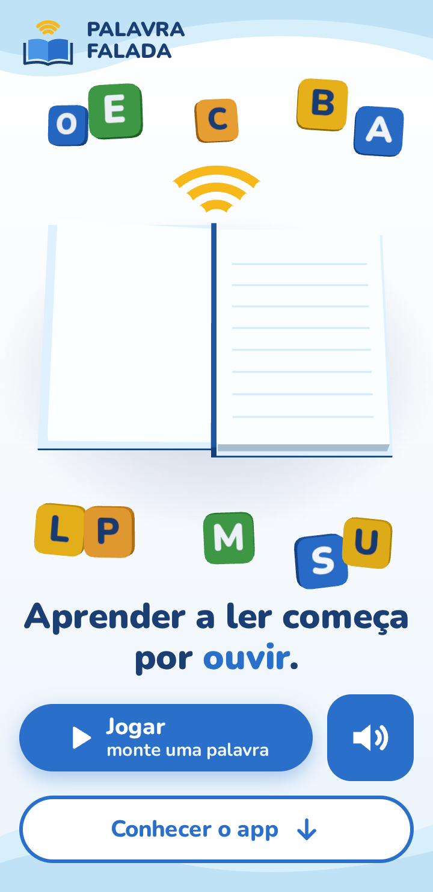
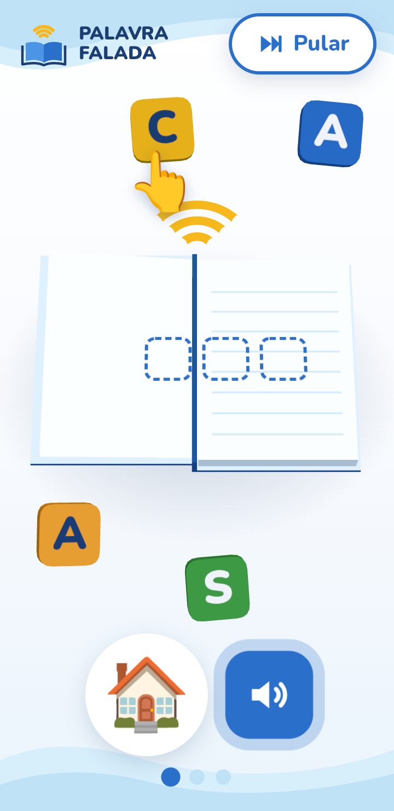
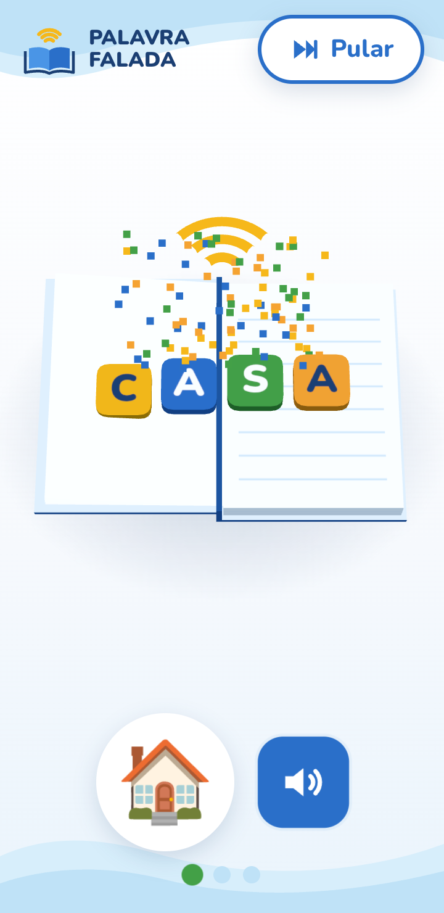
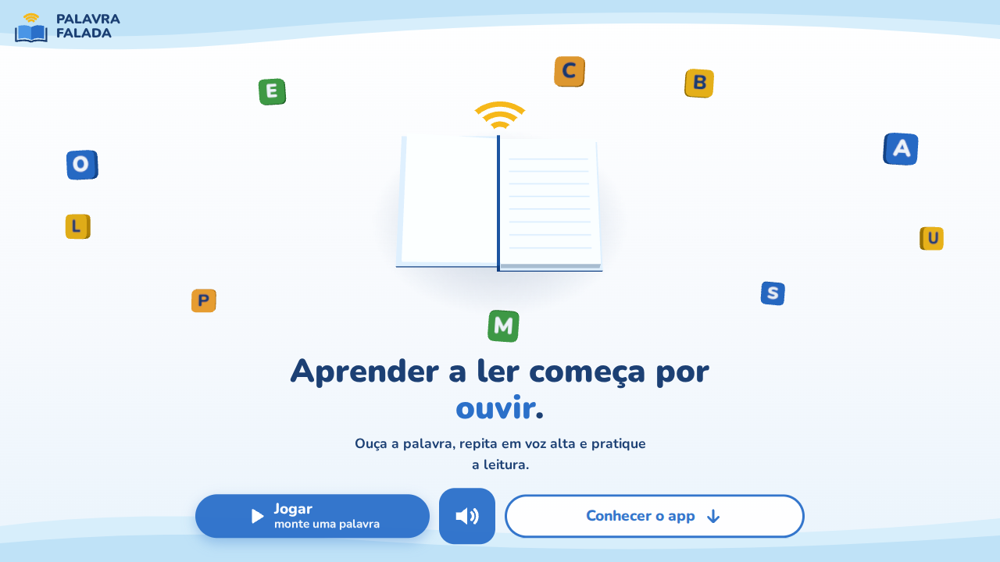

<div align="center">

# 📖 Palavra Falada — Site

**Ouvir, repetir e aprender a ler.**

Site de apresentação e download do **Palavra Falada**, um app para praticar a leitura em voz alta em turmas de alfabetização — de crianças e de EJA (Educação de Jovens e Adultos).



&nbsp;

&nbsp;


</div>

---

## ✨ O que tem no site

| | |
|---|---|
| 📖 **Abertura em 3D** | Um livro feito só com geometrias do Three.js abre, as páginas viram e letras saem voando de dentro dele. Dura menos de 4 segundos e tem botão **Pular**. |
| 🧩 **Mini-jogo opcional** | Toque em **Jogar** e monte as palavras **CASA**, **GATO** e **LIVRO**: cada letra é falada em voz alta; a certa voa até o livro, a errada só dá uma tremidinha. Funciona **só com toque e áudio** — uma mãozinha 👆 mostra onde tocar. |
| 🔊 **Tudo pode ser ouvido** | Cada bloco de texto tem um botão de alto-falante com voz neural em português do Brasil. Pensado para quem lê pouco ou ainda está aprendendo. |
| 📲 **Download do APK** | Botão grande que baixa a versão mais recente do app direto do GitHub Releases, com passo a passo de instalação. |



## 🎯 Para quem foi pensado

O público do app lê pouco ou nada e costuma usar **celulares Android simples com internet limitada**. Isso guiou todas as decisões:

- **Mobile first**, testado em telas de 360px.
- **Leve**: sem framework, fontes do sistema como reserva, texturas desenhadas em `<canvas>` (nenhuma imagem para baixar no 3D) e áudios que só baixam quando alguém toca no 🔊.
- **Econômico**: `pixelRatio` limitado a 2, materiais simples, sem sombras em tempo real, e o 3D **pausa** quando a aba fica escondida ou quando a pessoa rola a página.
- **Acessível**: alto contraste, letras grandes, alvos de toque com 48px ou mais, `aria-label` em todos os botões de ícone e respeito ao "reduzir movimento" do sistema.
- **Gentil**: o jogo nunca pune o erro — sem "errado!", sem buzina.

## 🚀 Como rodar

Precisa do [Node.js](https://nodejs.org/) 20 ou mais novo.

```bash
npm install       # instala as dependências
npm run dev       # abre em http://localhost:5173
```

O `npm run dev` já mostra um endereço `Network: http://192.168.x.x:5173` — abra no celular (mesmo Wi-Fi) para testar num aparelho de verdade.

| Comando | O que faz |
|---|---|
| `npm run dev` | Servidor de desenvolvimento (recarrega ao salvar) |
| `npm run build` | Gera a versão final otimizada em `dist/` |
| `npm run preview` | Abre a versão de `dist/` para conferir antes de publicar |
| `npm run audios` | Gera os áudios das falas (veja abaixo) |

## 🔊 Áudios (voz neural)

As falas do site são arquivos MP3 prontos em `public/audio/`, gerados com a voz **Antonio** (pt-BR) do serviço gratuito do "Ler em voz alta" do Microsoft Edge. Se um áudio falhar (ex.: sem internet), o site usa a voz do próprio aparelho.

**Mudou algum texto do site ou uma palavra do jogo? Rode:**

```bash
npm run audios
```

O script lê o `index.html` e o `src/game/words.js`, gera só os áudios que faltam e apaga os que não são mais usados. Precisa de internet só nesse momento. A voz e a velocidade ficam no topo de [`scripts/gerar-audios.mjs`](scripts/gerar-audios.mjs).

> O serviço do Edge é gratuito, sem conta nem chave, mas não é uma API oficial — ótimo para um projeto acadêmico.

## ⚙️ Configuração

| O quê | Onde |
|---|---|
| Link de download do APK | `DOWNLOAD_URL` em [`src/config.js`](src/config.js) |
| Palavras do mini-jogo | [`src/game/words.js`](src/game/words.js) (depois rode `npm run audios`) |
| Textos do site | [`index.html`](index.html) (depois rode `npm run audios`) |
| Cores | [`src/config.js`](src/config.js) (3D) e topo de [`src/styles/main.css`](src/styles/main.css) |

### Publicando o APK no GitHub Releases

O botão de download usa o link `…/releases/latest/download/palavra-falada.apk`, que **sempre aponta para o release mais recente**:

1. Em `src/config.js`, troque `[USUARIO]` e `[REPOSITORIO]` pelo repositório do app.
2. No GitHub, vá em **Releases → Draft a new release**, crie uma tag (ex.: `v1.0.0`) e anexe o APK com o nome exato **`palavra-falada.apk`**.
3. Pronto. Nas próximas versões, basta publicar um release novo com o arquivo de mesmo nome — o site não precisa mudar.

## 🗂️ Estrutura

```
├── index.html              # todos os textos do site
├── public/audio/           # falas em MP3 (geradas por npm run audios)
├── scripts/
│   └── gerar-audios.mjs    # gera os MP3 com voz neural
├── designer/               # telas do app usadas como referência visual
├── docs/                   # imagens deste README
└── src/
    ├── main.js             # junta tudo: abertura → texto → jogo
    ├── config.js           # link do APK e cores
    ├── scene/              # Three.js
    │   ├── setupScene.js   #   renderer, câmera, luzes, loop (pausa fora da tela)
    │   ├── book.js         #   o livro 3D (capa e páginas giram na "dobradiça")
    │   ├── letters.js      #   blocos de letras 3D
    │   ├── intro.js        #   animação de abertura (GSAP timeline)
    │   └── confetti.js     #   confete com partículas
    ├── game/
    │   ├── wordGame.js     #   o mini-jogo (Raycaster para saber em qual letra tocou)
    │   └── words.js        #   palavras e nomes das letras
    ├── audio/
    │   ├── speech.js       #   toca o MP3 ou usa a voz do aparelho
    │   ├── speechText.js   #   texto → nome do arquivo (usado pelo site e pelo script)
    │   ├── extraPhrases.js #   falas do jogo que não estão no HTML
    │   └── sfx.js          #   sons de acerto/erro (Web Audio, sem arquivos)
    ├── ui/                 # botões e painéis em HTML
    └── styles/main.css
```

O código tem comentários em português explicando as partes de Three.js e GSAP.

## 🛠️ Tecnologias

- [Vite](https://vite.dev/) — servidor de desenvolvimento e build
- [Three.js](https://threejs.org/) — cena 3D (livro, letras, confete)
- [GSAP](https://gsap.com/) — animações
- Web Speech API e Web Audio API — voz de reserva e efeitos sonoros
- [msedge-tts](https://www.npmjs.com/package/msedge-tts) e [node-html-parser](https://www.npmjs.com/package/node-html-parser) — só no script que gera os áudios

## 🧭 Próximos passos

- [ ] Versão simplificada para celulares fracos e para quem prefere menos movimento
- [ ] Se o navegador não tiver WebGL, ir direto para o conteúdo
- [ ] Alternativa acessível ao mini-jogo para teclado e leitor de tela
- [ ] Publicar o primeiro APK no GitHub Releases

## 🎓 Sobre o projeto

Projeto acadêmico do curso de **Ciência da Computação** do **Centro Universitário Maurício de Nassau**.

O app Palavra Falada (React Native + Expo) já funciona de ponta a ponta: o professor cria turmas e listas de palavras, e o aluno entra pelo QR Code — sem conta e sem senha —, ouve cada palavra e repete em voz alta.

### 👥 Equipe

- Eduardo Martins da Silva
- Jorge Luiz da Silva Magalhães
- Thiago Victor Dias Macêdo
- Heitor Oliveira Terto
- João Claudio Bezerra Silva Rodrigues

## 📄 Licença

Distribuído sob a licença [MIT](LICENSE).
